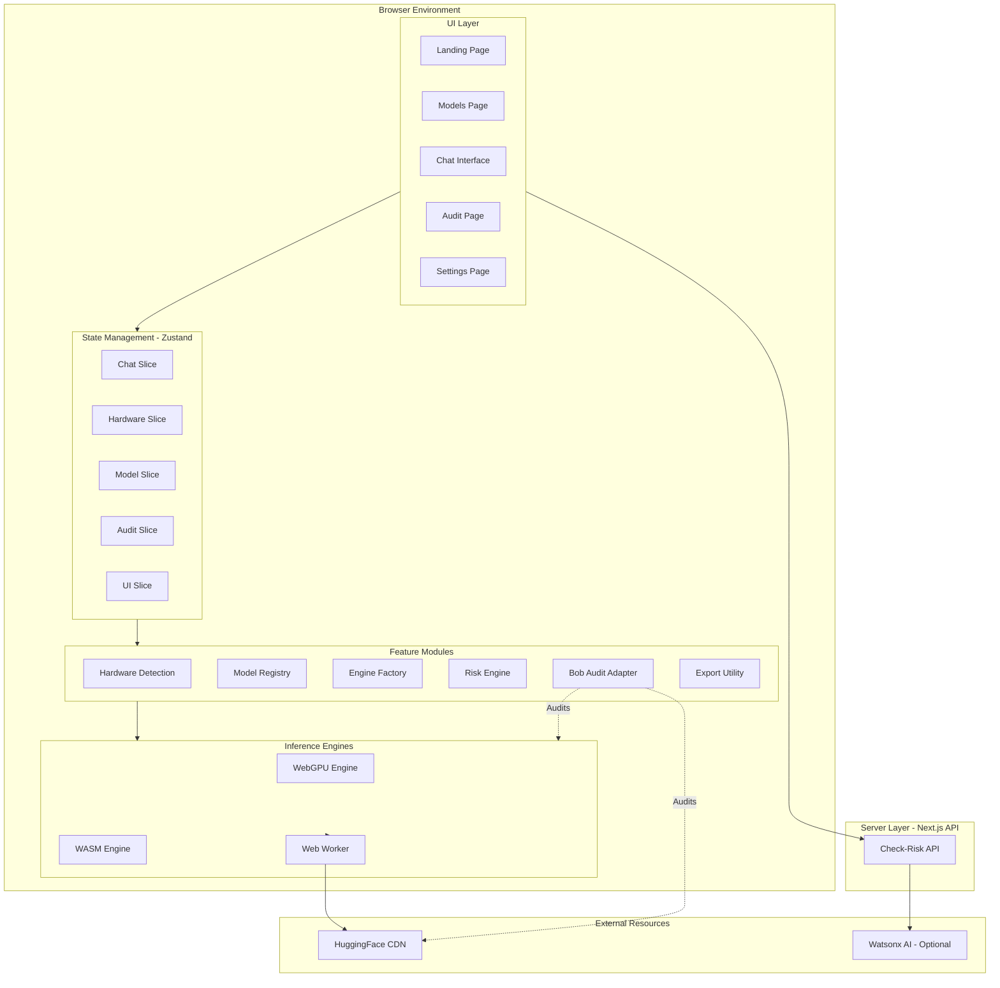
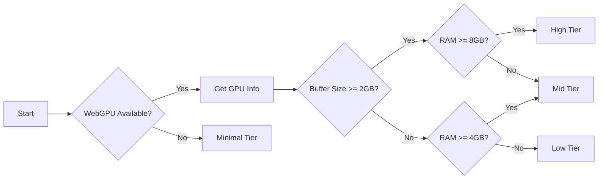
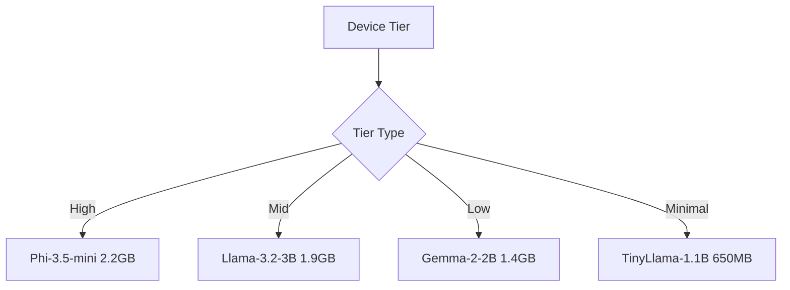
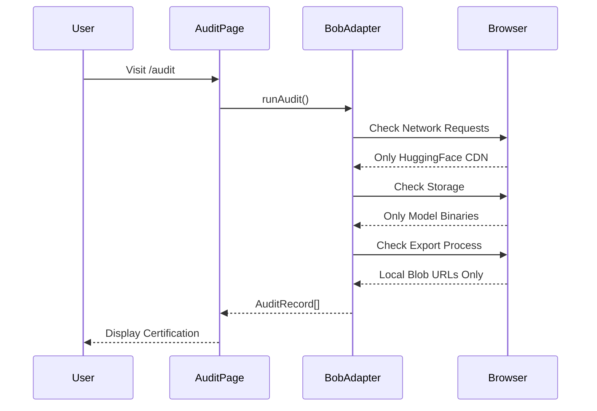
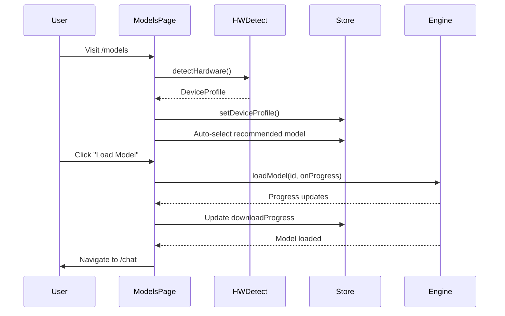
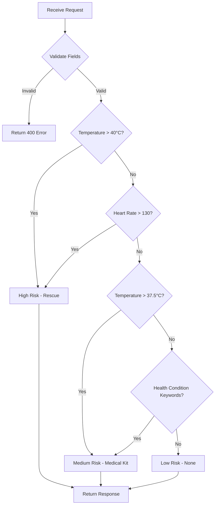

# CipherDev Implementation Plan

## Project Overview

**CipherDev** is a privacy-first, browser-based AI chat application that runs Large Language Models (LLMs) entirely client-side using WebGPU/WASM. Zero data leaves the device. No backend for chat, no API keys, no cloud telemetry.

### Key Features
- 🔒 **100% Client-Side AI**: All inference runs in the browser
- 🚀 **WebGPU Acceleration**: Hardware-accelerated inference with WASM fallback
- 🔍 **IBM Bob Privacy Audit**: Automated privacy certification system
- 🏥 **Health Risk Assessment**: Server-side API for disaster/health risk evaluation
- 📊 **Hardware Detection**: Automatic device capability detection and model recommendation

---

## Technology Stack

| Layer | Technology | Version | Purpose |
|-------|-----------|---------|---------|
| Framework | Next.js | 14.x | React framework with App Router |
| Language | TypeScript | 5.x | Type-safe development |
| UI Library | React | 19.x | Component framework |
| Styling | Tailwind CSS | 4.x | Utility-first CSS |
| LLM Engine | @mlc-ai/web-llm | ^0.2.83 | WebGPU-based inference |
| WASM Fallback | @xenova/transformers | ^2.17.2 | CPU-based inference |
| State Management | Zustand | ^5.x | Lightweight state management |
| Icons | Lucide React | Latest | Icon library |
| Utilities | clsx, tailwind-merge | Latest | Conditional classes |

---

## Architecture Overview



---

## Project Structure

```
chipherdev/
├── app/
│   ├── layout.tsx                    # Root layout (force-dynamic, dark theme)
│   ├── page.tsx                      # Landing page
│   ├── globals.css                   # Global styles
│   ├── global-error.tsx              # Error boundary
│   ├── not-found.tsx                 # 404 page
│   ├── api/
│   │   └── check-risk/
│   │       └── route.ts              # Risk assessment API
│   └── (app)/
│       ├── layout.tsx                # App shell (sidebar + topbar)
│       ├── models/page.tsx           # Model selection
│       ├── chat/page.tsx             # Chat interface
│       ├── audit/page.tsx            # IBM Bob audit
│       └── settings/page.tsx         # Settings
├── components/
│   ├── ui/
│   │   ├── button.tsx
│   │   ├── badge.tsx
│   │   ├── card.tsx
│   │   ├── progress.tsx
│   │   └── modal.tsx
│   ├── layout/
│   │   ├── shell.tsx
│   │   ├── sidebar.tsx
│   │   └── topbar.tsx
│   └── check-risk/
│       └── RiskCheckButton.tsx
├── features/
│   ├── hardware/
│   │   ├── detectHardware.ts
│   │   └── classifyDevice.ts
│   ├── llm/
│   │   ├── llm.types.ts
│   │   ├── modelRegistry.ts
│   │   ├── engineFactory.ts
│   │   ├── webgpuEngine.ts
│   │   ├── wasmEngine.ts
│   │   └── riskEngine.ts
│   ├── conversation/
│   │   └── exportTxt.ts
│   └── audit/
│       └── bobAuditAdapter.ts
├── store/
│   ├── types.ts
│   ├── useAppStore.ts
│   └── slices/
│       ├── chatSlice.ts
│       ├── hardwareSlice.ts
│       ├── modelSlice.ts
│       ├── auditSlice.ts
│       └── uiSlice.ts
├── worker/
│   └── llm.worker.ts
├── lib/
│   └── utils.ts
├── bob_sessions/                     # Privacy proof screenshots
├── next.config.ts
├── tsconfig.json
├── postcss.config.mjs
├── eslint.config.mjs
├── .env.local.example
└── README.md
```

---

## Implementation Phases

### Phase 1: Project Initialization (Tasks 1-3)
**Goal**: Set up the Next.js project with proper configuration

1. Initialize Next.js 14 with TypeScript and Tailwind CSS v4
2. Install all dependencies
3. Create folder structure

**Commands**:
```bash
npx create-next-app@latest chipherdev --typescript --tailwind --app --no-src-dir
cd chipherdev
npm install @mlc-ai/web-llm@^0.2.83 @xenova/transformers@^2.17.2
npm install zustand@^5 lucide-react clsx tailwind-merge
```

---

### Phase 2: Core Infrastructure (Tasks 4-13)
**Goal**: Build foundational systems

#### 2.1 Utilities & Types (Tasks 4-5)
- Create [`lib/utils.ts`](lib/utils.ts) with `cn()` helper
- Define TypeScript interfaces in [`store/types.ts`](store/types.ts)
- Define LLM types in [`features/llm/llm.types.ts`](features/llm/llm.types.ts)

#### 2.2 Hardware Detection (Tasks 6-7)
- Implement [`features/hardware/detectHardware.ts`](features/hardware/detectHardware.ts)
  - WebGPU adapter detection
  - GPU name and limits
  - RAM and CPU cores
  - Mobile detection
- Implement [`features/hardware/classifyDevice.ts`](features/hardware/classifyDevice.ts)
  - Device tier classification (High/Mid/Low/Minimal)

**Hardware Detection Flow**:


#### 2.3 LLM Infrastructure (Tasks 8-12)
- Build [`features/llm/modelRegistry.ts`](features/llm/modelRegistry.ts)
  - 4 models: TinyLlama (650MB), Gemma 2 (1.4GB), Llama 3.2 (1.9GB), Phi-3.5 (2.2GB)
- Create [`features/llm/engineFactory.ts`](features/llm/engineFactory.ts)
  - Singleton pattern for engine management
- Implement [`features/llm/webgpuEngine.ts`](features/llm/webgpuEngine.ts)
  - Dynamic import of @mlc-ai/web-llm
  - Streaming chat completions
- Implement [`features/llm/wasmEngine.ts`](features/llm/wasmEngine.ts)
  - @xenova/transformers integration
- Build [`features/llm/riskEngine.ts`](features/llm/riskEngine.ts)
  - Rule-based health risk assessment
- Create [`worker/llm.worker.ts`](worker/llm.worker.ts)
  - Web Worker for background inference

**Model Selection Logic**:


#### 2.4 Web Worker Setup (Task 13)
- Use Next.js built-in worker support (no worker-loader needed)
- Handle message passing for model loading and inference

---

### Phase 3: State Management (Tasks 14-19)
**Goal**: Implement Zustand store with all slices

#### Store Architecture:
```mermaid
graph TB
    Store[useAppStore] --> Chat[chatSlice]
    Store --> Hardware[hardwareSlice]
    Store --> Model[modelSlice]
    Store --> Audit[auditSlice]
    Store --> UI[uiSlice]
    
    Chat --> Messages[messages: ChatMessage[]]
    Chat --> Generating[isGenerating: boolean]
    Chat --> Actions1[addMessage, updateLastMessage, clearHistory]
    
    Hardware --> Profile[deviceProfile: DeviceProfile]
    Hardware --> Actions2[setDeviceProfile]
    
    Model --> Selected[selectedModelId: string]
    Model --> Loaded[loadedModelId: string]
    Model --> Progress[downloadProgress: number]
    Model --> Actions3[loadModel, unloadModel]
    
    Audit --> Logs[auditLogs: AuditRecord[]]
    Audit --> Actions4[runAudit]
    
    UI --> Sidebar[sidebarOpen: boolean]
    UI --> Modal[modalState: object]
    UI --> Actions5[toggleSidebar, openModal]
```

**Files to Create**:
- [`store/useAppStore.ts`](store/useAppStore.ts) - Main store combining all slices
- [`store/slices/chatSlice.ts`](store/slices/chatSlice.ts)
- [`store/slices/hardwareSlice.ts`](store/slices/hardwareSlice.ts)
- [`store/slices/modelSlice.ts`](store/slices/modelSlice.ts)
- [`store/slices/auditSlice.ts`](store/slices/auditSlice.ts)
- [`store/slices/uiSlice.ts`](store/slices/uiSlice.ts)

---

### Phase 4: Feature Modules (Tasks 20-21)
**Goal**: Build supporting features

- Implement [`features/audit/bobAuditAdapter.ts`](features/audit/bobAuditAdapter.ts)
  - Network request analysis
  - Storage verification
  - System checks
- Build [`features/conversation/exportTxt.ts`](features/conversation/exportTxt.ts)
  - Export chat history as .txt file

**IBM Bob Audit Flow**:


---

### Phase 5: UI Components (Tasks 22-30)
**Goal**: Build reusable UI components

#### 5.1 Base Components (Tasks 22-26)
- [`components/ui/button.tsx`](components/ui/button.tsx) - Variants: primary, secondary, ghost
- [`components/ui/badge.tsx`](components/ui/badge.tsx) - Status indicators
- [`components/ui/card.tsx`](components/ui/card.tsx) - Glassmorphism style
- [`components/ui/progress.tsx`](components/ui/progress.tsx) - Model download progress
- [`components/ui/modal.tsx`](components/ui/modal.tsx) - Confirmation dialogs

#### 5.2 Layout Components (Tasks 27-29)
- [`components/layout/shell.tsx`](components/layout/shell.tsx) - Main container
- [`components/layout/sidebar.tsx`](components/layout/sidebar.tsx) - Navigation
- [`components/layout/topbar.tsx`](components/layout/topbar.tsx) - Header

#### 5.3 Feature Components (Task 30)
- [`components/check-risk/RiskCheckButton.tsx`](components/check-risk/RiskCheckButton.tsx)
  - Form with age, location, health condition, temperature
  - POST to `/api/check-risk`
  - Display risk level with color-coded badges

**Design System**:
- Background: `bg-black` (root), `bg-gray-950` (panels)
- Glassmorphism: `bg-gray-900/50 border border-gray-800/50 backdrop-blur-sm`
- Glow: `shadow-[0_0_30px_rgba(59,130,246,0.1)]`
- Text: `text-gray-100` (primary), `text-gray-400` (secondary)
- Risk Colors:
  - Low: `bg-green-900/50 text-green-400`
  - Medium: `bg-yellow-900/50 text-yellow-400`
  - High: `bg-red-900/50 text-red-400`

---

### Phase 6: Pages & Routes (Tasks 31-40)
**Goal**: Build all application pages

#### 6.1 Landing Page (Task 31)
[`app/page.tsx`](app/page.tsx)
- Hero section with animated entrance
- 3 feature cards:
  1. 🔒 Privacy-First AI
  2. 🚀 WebGPU Acceleration
  3. 🔍 IBM Bob Certified
- CTA button to `/models`

#### 6.2 Root Layout (Task 32)
[`app/layout.tsx`](app/layout.tsx)
- `export const dynamic = 'force-dynamic'`
- Dark theme metadata
- Font configuration

#### 6.3 App Shell (Task 33)
[`app/(app)/layout.tsx`](app/(app)/layout.tsx)
- Sidebar + Topbar integration
- Responsive layout

#### 6.4 Models Page (Task 34)
[`app/(app)/models/page.tsx`](app/(app)/models/page.tsx)
- Hardware detection on mount
- Display device tier banner
- Grid of 4 model cards
- Highlight recommended model
- Load button with progress bar
- Navigate to `/chat` on success

**Models Page Flow**:


#### 6.5 Chat Page (Task 35)
[`app/(app)/chat/page.tsx`](app/(app)/chat/page.tsx)
- System prompt injection:
  - Identity: "CipherDev, a secure browser-local AI assistant"
  - Current datetime + timezone
  - Loaded model name + backend
  - Output format: `<answer>` and `<reasoning>` XML tags
- Quick-reply shortcuts (greetings, model info, date)
- Streaming with cursor animation
- Token count + speed badge per message
- "End Session" modal: export or delete
- Collapsible reasoning blocks

#### 6.6 Audit Page (Task 36)
[`app/(app)/audit/page.tsx`](app/(app)/audit/page.tsx)
- Run `BobAuditAdapter.runAudit()` on mount
- Header: "IBM Bob Privacy Audit"
- Green certification card
- Audit log entries with icons and timestamps
- "Verified Safe" badges

#### 6.7 Settings Page (Task 37)
[`app/(app)/settings/page.tsx`](app/(app)/settings/page.tsx)
- Basic configuration options
- Theme preferences (future)
- Export/import settings

#### 6.8 API Route (Task 38)
[`app/api/check-risk/route.ts`](app/api/check-risk/route.ts)
- POST handler
- Validate: age, location, healthCondition, temperature
- Call `assessRisk()` from riskEngine
- Return JSON: `{ risk, action, reason }`

**Risk Assessment Logic**:


#### 6.9 Error Pages (Tasks 39-40)
- [`app/global-error.tsx`](app/global-error.tsx) - Error boundary
- [`app/not-found.tsx`](app/not-found.tsx) - 404 page

---

### Phase 7: Configuration (Tasks 41-46)
**Goal**: Configure build tools and documentation

#### 7.1 Next.js Config (Task 41)
[`next.config.ts`](next.config.ts)
```typescript
const nextConfig = {
  headers: async () => [
    {
      source: '/:path*',
      headers: [
        { key: 'Cross-Origin-Embedder-Policy', value: 'require-corp' },
        { key: 'Cross-Origin-Opener-Policy', value: 'same-origin' },
      ],
    },
  ],
};
```

#### 7.2 Global Styles (Task 42)
[`app/globals.css`](app/globals.css)
- Tailwind v4 directives
- Dark theme variables
- Custom animations
- Glassmorphism utilities

#### 7.3 TypeScript Config (Task 43)
[`tsconfig.json`](tsconfig.json)
- Strict mode enabled
- Path aliases: `@/*`
- Target: ES2022

#### 7.4 Environment Template (Task 44)
[`.env.local.example`](.env.local.example)
```bash
# Optional: Watsonx AI Integration
WATSONX_API_KEY=
WATSONX_PROJECT_ID=
WATSONX_URL=https://us-south.ml.cloud.ibm.com
```

#### 7.5 Bob Sessions Directory (Task 45)
Create `bob_sessions/` for proof screenshots

#### 7.6 README (Task 46)
[`README.md`](README.md)
- Project overview
- Setup instructions
- Architecture diagram
- Privacy guarantees
- Screenshot guide

---

### Phase 8: Testing & Validation (Tasks 47-52)
**Goal**: Verify all functionality

1. **Hardware Detection** (Task 47)
   - Open browser console
   - Verify WebGPU detection
   - Check device tier classification

2. **Model Loading** (Task 48)
   - Test progress tracking
   - Verify model download from HuggingFace
   - Check compilation status

3. **Chat Streaming** (Task 49)
   - Test system prompt injection
   - Verify streaming responses
   - Check XML tag parsing

4. **Risk Assessment API** (Task 50)
   - Test with various inputs
   - Verify risk level calculation
   - Check error handling

5. **IBM Bob Audit** (Task 51)
   - Run audit page
   - Verify all checks pass
   - Confirm certification display

6. **WASM Fallback** (Task 52)
   - Disable WebGPU in browser flags
   - Verify WASM engine loads
   - Test inference performance

---

### Phase 9: Privacy Proof (Tasks 53-58)
**Goal**: Capture bob_session screenshots

#### Screenshot Checklist:

1. **01-landing.png** (Task 53)
   - URL: `http://localhost:3000/`
   - Capture: Hero + 3 feature cards
   - Verify: Animations visible

2. **02-hardware-detection.png** (Task 54)
   - URL: `http://localhost:3000/models`
   - Capture: Blue hardware banner
   - Verify: GPU name, tier, RAM displayed

3. **03-model-loading.png** (Task 55)
   - URL: `http://localhost:3000/models`
   - Capture: Progress bar at ~50%
   - Verify: Download percentage visible

4. **04-chat-session.png** (Task 56)
   - URL: `http://localhost:3000/chat`
   - Capture: Ask "What model are you running?"
   - Verify: Response shows model name + backend

5. **05-bob-audit-page.png** (Task 57)
   - URL: `http://localhost:3000/audit`
   - Capture: Full page
   - Verify: Green cert card + 3 verified logs

6. **06-network-devtools.png** (Task 58)
   - Open: DevTools → Network tab
   - Filter: XHR/Fetch
   - Capture: Only `huggingface.co` requests
   - Verify: No other external requests

**These 6 screenshots constitute the complete bob_session - IBM Bob's visual proof of privacy certification.**

---

## Key Technical Decisions

### 1. Next.js 14 vs 15
**Decision**: Use Next.js 14 (latest stable)
**Reason**: Better ecosystem support, proven stability

### 2. Worker Implementation
**Decision**: Use Next.js built-in worker support
**Reason**: No need for worker-loader, simpler configuration

### 3. Risk Assessment
**Decision**: Rule-based logic with Watsonx placeholder
**Reason**: No credentials provided, ensure robust fallback

### 4. WASM Fallback
**Decision**: Implement robust @xenova/transformers integration
**Reason**: Ensure app works on non-WebGPU devices

---

## Privacy Guarantees

### What Stays Local:
✅ All chat messages and conversations
✅ User preferences and settings
✅ Model weights (cached in IndexedDB)
✅ Hardware detection results
✅ Audit logs

### What Leaves the Device:
❌ Nothing for chat functionality
✅ Only model weight downloads from HuggingFace CDN (one-time)
✅ Optional: Risk assessment API calls (server-side, no chat data)

### IBM Bob Certification:
- Network analysis: Only HuggingFace model shards
- Storage analysis: Only binary model data
- Export analysis: Local Blob URLs only
- Zero telemetry, zero tracking, zero data transmission

---

## Performance Targets

| Metric | Target | Notes |
|--------|--------|-------|
| Model Download | < 5 min | For 2GB model on 10 Mbps |
| First Token | < 2s | After model loaded |
| Tokens/Second | 10-50 | Depends on hardware tier |
| Memory Usage | < 4GB | For largest model |
| Page Load | < 1s | Initial landing page |

---

## Success Criteria

- [ ] All 4 models load successfully on appropriate hardware
- [ ] Chat streaming works smoothly with system prompt
- [ ] Hardware detection accurately classifies devices
- [ ] IBM Bob audit passes all checks
- [ ] Risk assessment API returns correct results
- [ ] WASM fallback works without WebGPU
- [ ] All 6 bob_session screenshots captured
- [ ] Zero external requests except HuggingFace CDN
- [ ] Export functionality creates local files only
- [ ] Dark theme consistent across all pages

---

## Next Steps

After reviewing this plan, we'll switch to **Code mode** to implement the solution step-by-step, following the task order defined in the todo list.

**Ready to proceed?** Please review this plan and let me know if you'd like any adjustments before we begin implementation.