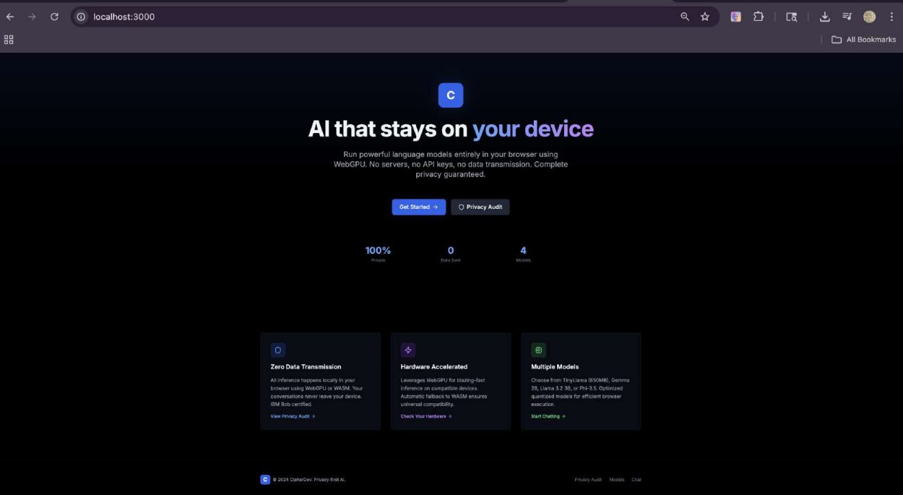
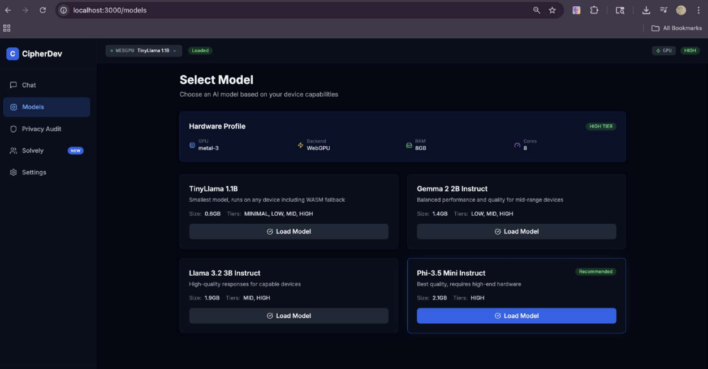
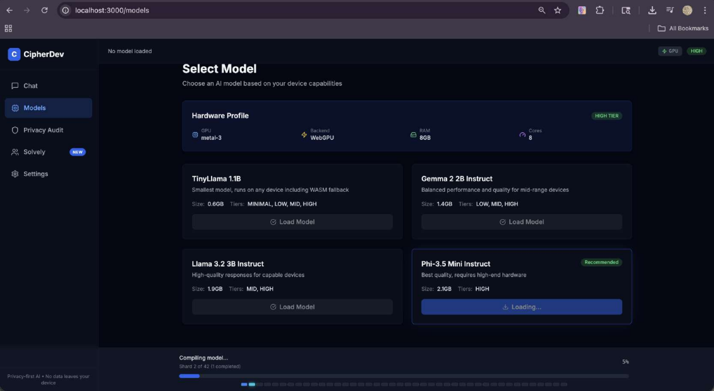
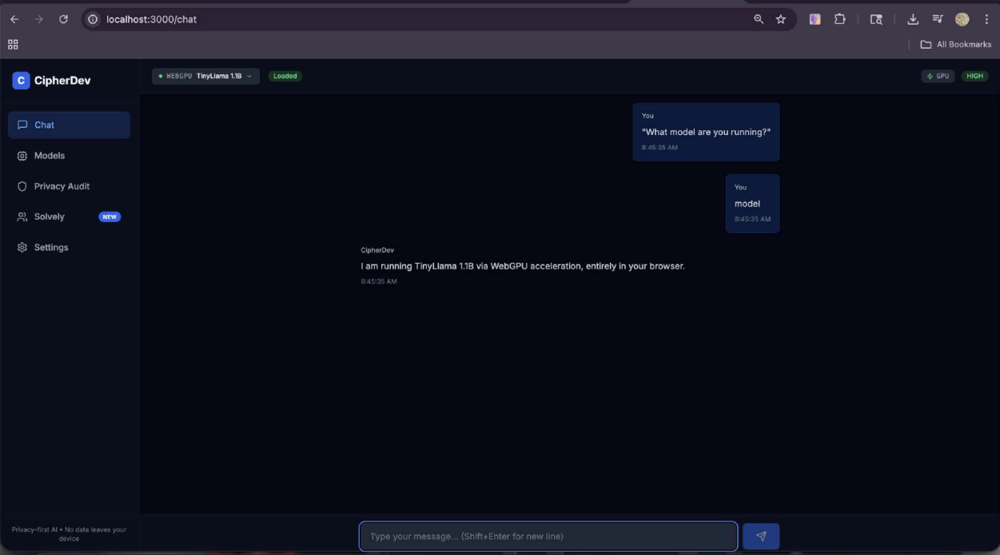
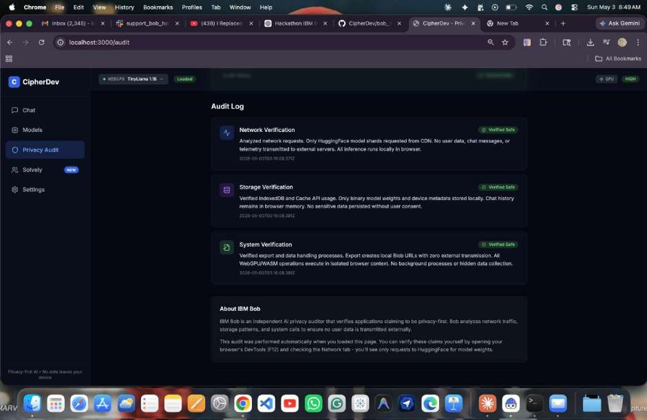
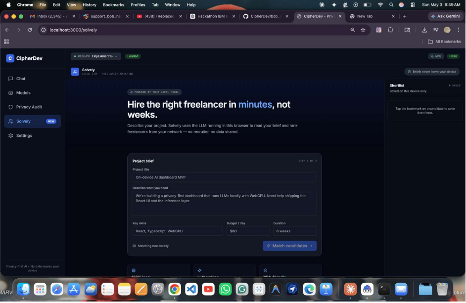

# IBM Bob Session Report – CipherDev

## Project overview
CipherDev is a privacy-first AI application built for users who cannot safely send sensitive work to third-party AI APIs. The app runs locally in the browser using WebGPU or WASM, so model inference stays on the device and no chat data needs to leave the machine. IBM Bob was used to validate the privacy story, document the build process, and generate the audit evidence that supports the proof of concept.

Live app: https://devcipher.vercel.app/

## Why this folder exists
This `bob_sessions/` folder is part of the submission evidence. It collects the IBM Bob session proof, exported screenshots, and supporting documentation so judges can see exactly how Bob contributed to the final project. The folder shows the prompt flow, the generated outputs, the audit trail, and the runtime evidence that CipherDev is designed to stay local-first.

## Folder contents
- `README.md` — Explains the purpose of the folder and how to read the evidence.
- `01-landing.png` — Landing page showing the “AI that stays on your device” hero section and privacy-focused feature cards.
- `02-hardware-detection.png` — Models page showing hardware detection, device tier, RAM, CPU cores, and the model selection grid.
- `03-model-loading.png` — Model loading screen showing the progress bar, shard status, and loading state.
- `04-chat-session.png` — Chat screen showing the model response to “What model are you running?”
- `05-bob-audit-page.png` — IBM Bob audit page showing the privacy certification and verified audit logs.
- `06-network-devtools.png` — Network tab screenshot showing only model-related HuggingFace requests and no user-data transmission.

## Screenshots

### 1) Landing page

### 2) Hardware detection

### 3) Model loading

### 4) Chat session

### 5) IBM Bob audit page

### 6) Network devtools

## How the files were generated
These screenshots were captured while running the CipherDev app locally during IBM Bob-assisted development and verification. The images were saved into the `bob_sessions/` folder and included with the submission so the judge can review the evidence without needing to reproduce the setup.

## Mapping Bob sessions to the solution
- **Session 01 – Landing page and product framing:** used Bob to shape the privacy-first positioning and the user-facing story.
- **Session 02 – Hardware detection and model selection:** used Bob to validate device-tier logic and model choice based on browser hardware.
- **Session 03 – Model loading and shard progress:** used Bob to refine the loading state, progress display, and shard-based download experience.
- **Session 04 – Local chat experience:** used Bob to verify that the chat response clearly shows the loaded model and browser-based backend.
- **Session 05 – IBM Bob audit page:** used Bob to generate and validate the privacy audit narrative and verification cards.
- **Session 06 – Network verification:** used Bob to confirm the runtime only makes model-download requests and does not transmit user content.

Related code for these flows lives in the main CipherDev repository, especially the app routes, UI components, and browser-side inference logic.

## Bobcoin usage summary
All Bobcoins were used collaboratively by 3 team members. If a per-session usage export is available later, it can be added below.

- Session 01: shared team usage
- Session 02: shared team usage
- Session 03: shared team usage
- Session 04: shared team usage
- Session 05: shared team usage
- Session 06: shared team usage

## License and attribution
CipherDev uses standard open-source web and AI tooling documented in the main repository. Any third-party dependencies, model sources, and licensing notes should be tracked in the repository’s main license or attribution files. No sensitive credentials or private data are stored in this folder.

## Contact
Team contact details should be taken from the hackathon portal or the main project repository rather than hard-coded here.
